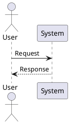

# Skhema v2 Implementation Plan

> **For agentic workers:** REQUIRED: Use superpowers-extended-cc:subagent-driven-development (if subagents available) or superpowers-extended-cc:executing-plans to implement this plan. Steps use checkbox (`- [ ]`) syntax for tracking.

**Goal:** Replace hand-rolled parsers with real libraries, switch from Kroki to direct PlantUML rendering, produce true merged PDF decks, add ADR linkage, package in Docker, and add E2E tests.

**Architecture:** Each module keeps its current public API — callers don't change. Parsers swap internals from hand-rolled to PyYAML/mistune. Rendering swaps HTTP-to-Kroki with subprocess-to-PlantUML. ADR is a new module that integrates into existing gallery/docs outputs. Docker wraps everything with zero-config.

**Tech Stack:** Python 3.13, PyYAML, mistune, pypdf, python-pptx, uv, PlantUML native binary, wkhtmltopdf, Docker

**Spec:** `docs/superpowers/specs/2026-03-24-skhema-v2-design.md`

---

## File Structure

### New files
- `pyproject.toml` — package metadata, dependencies, entry points
- `Dockerfile` — multi-stage, optimized
- `docker-compose.yml` — convenience wrapper
- `.dockerignore` — exclude .git, clients, __pycache__
- `skhema/cli.py` — CLI dispatcher (replaces bash wrapper logic)
- `gnosis/cli.py` — CLI dispatcher (replaces bash wrapper logic)
- `skhema/scripts/adr.py` — ADR parsing and linkage
- `skhema/tests/test_adr.py` — ADR unit tests
- `tests/e2e/conftest.py` — shared E2E fixtures
- `tests/e2e/test_render_pipeline.py`
- `tests/e2e/test_gallery_pipeline.py`
- `tests/e2e/test_docs_pipeline.py`
- `tests/e2e/test_deck_pipeline.py`
- `tests/e2e/test_validate_pipeline.py`
- `tests/e2e/test_gnosis_pipeline.py`
- `tests/e2e/test_adr_pipeline.py`
- `tests/e2e/fixtures/mock_workspace/` — minimal client workspace
- `tests/e2e/fixtures/mock_rendered/` — pre-rendered SVG/PDF
- `clients/demo/adrs/` — NovaPay ADR files

### Modified files
- `skhema/scripts/manifest.py` — replace hand-rolled parser with PyYAML
- `skhema/scripts/gallery.py` — replace parse_client_yaml with PyYAML, add ADR panel
- `skhema/scripts/docs.py` — replace parse_markdown with mistune, add ADR subsections
- `skhema/scripts/render.py` — replace Kroki HTTP with PlantUML subprocess
- `skhema/scripts/deck.py` — true PDF merge with pypdf PdfWriter
- `skhema/scripts/validate.py` — no changes (uses manifest.py API which stays stable)
- `skhema/scripts/generate_excalidraw_lib.py` — fillStyle cross-hatch, strokeWidth 1 (already done)
- `gnosis/scripts/parsers.py` — replace count_yaml_entries with PyYAML
- `gnosis/scripts/readiness.py` — replace _safe_yaml_parse with PyYAML
- `gnosis/scripts/status.py` — add ADR coverage metric
- `skhema/tests/test_manifest.py` — update tests for PyYAML-based parser
- `skhema/tests/test_gallery.py` — update parse_client_yaml tests
- `skhema/tests/test_docs.py` — update parse_markdown tests for mistune
- `skhema/tests/test_render.py` — update for subprocess-based rendering
- `skhema/tests/test_deck.py` — update for PDF merge
- `gnosis/tests/test_parsers.py` — update for PyYAML
- `gnosis/tests/test_readiness.py` — update for PyYAML

---

## Task 0: Project Setup — pyproject.toml and uv

**Files:**
- Create: `pyproject.toml`
- Create: `.python-version`
- Create: `skhema/__init__.py`
- Create: `gnosis/__init__.py`

**Known limitation:** The existing codebase uses `from scripts.X import Y` imports (assuming `PYTHONPATH=skhema`). This convention is preserved throughout the plan. The `[tool.pytest.ini_options]` pythonpath setting handles test discovery. Full package-style imports (`from skhema.scripts.X`) are a future cleanup.

- [ ] **Step 1: Create pyproject.toml**

```toml
[build-system]
requires = ["hatchling"]
build-backend = "hatchling.build"

[project]
name = "skhema"
version = "0.1.0"
requires-python = ">=3.13"
dependencies = [
    "PyYAML",
    "mistune",
    "pypdf",
    "python-pptx",
]

[project.optional-dependencies]
dev = [
    "pytest",
]

[tool.pytest.ini_options]
pythonpath = ["skhema", "gnosis"]
```

Note: `[project.scripts]` entry points are omitted for now — `bin/skhema` and `bin/gnosis` remain the primary CLI entry points. Package-level entry points will be added when the import convention is unified.

- [ ] **Step 2: Create .python-version**

```
3.13
```

- [ ] **Step 2b: Create package __init__.py files**

Create empty `skhema/__init__.py` and `gnosis/__init__.py` (required for Python package recognition):

```python
# skhema/__init__.py
# gnosis/__init__.py
```

- [ ] **Step 3: Initialize uv and generate lock file**

Run: `uv sync`
Expected: `uv.lock` generated, `.venv/` created, all dependencies installed

- [ ] **Step 4: Verify dependencies installed**

Run: `uv run python -c "import yaml; import mistune; import pypdf; import pptx; print('all good')"`
Expected: `all good`

- [ ] **Step 5: Commit**

```bash
git add pyproject.toml uv.lock .python-version
git commit -m "feat: add pyproject.toml with uv and dependencies"
```

---

## Task 1: Replace YAML Parsers with PyYAML

**Files:**
- Modify: `skhema/scripts/manifest.py:9-95`
- Modify: `skhema/scripts/gallery.py:32-59`
- Modify: `gnosis/scripts/parsers.py:11-38`
- Modify: `gnosis/scripts/readiness.py:55-146`
- Test: `skhema/tests/test_manifest.py`
- Test: `skhema/tests/test_gallery.py`
- Test: `gnosis/tests/test_parsers.py`
- Test: `gnosis/tests/test_readiness.py`

### 1a: manifest.py

- [ ] **Step 1: Run existing tests to confirm green baseline**

Run: `uv run pytest skhema/tests/test_manifest.py -v`
Expected: All 4 tests pass (test_parses_domains, test_element_fields, test_multiple_domains, test_real_manifest)

- [ ] **Step 2: Replace parse_manifest() with PyYAML**

Replace lines 9–95 of `skhema/scripts/manifest.py` with:

```python
import yaml


def parse_manifest(manifest_path: str) -> dict[str, list[dict]]:
    """Parse manifest.yaml and return {domain: [elements]} using PyYAML."""
    with open(manifest_path) as f:
        data = yaml.safe_load(f)

    result = {}
    for domain_name, domain_data in (data.get("domains") or {}).items():
        elements = []
        for elem_id, elem_props in (domain_data.get("elements") or {}).items():
            elements.append({
                "id": elem_id,
                "type": (elem_props or {}).get("type", ""),
                "description": (elem_props or {}).get("description", ""),
            })
        result[domain_name] = elements
    return result
```

Keep `parse_manifest_ids()` (lines 98–104) unchanged — it calls `parse_manifest()`.

- [ ] **Step 3: Run tests to verify nothing broke**

Run: `uv run pytest skhema/tests/test_manifest.py -v`
Expected: All 4 tests pass

- [ ] **Step 4: Commit**

```bash
git add skhema/scripts/manifest.py
git commit -m "refactor: replace hand-rolled manifest parser with PyYAML"
```

### 1b: gallery.py parse_client_yaml

- [ ] **Step 5: Run existing tests**

Run: `uv run pytest skhema/tests/test_gallery.py::TestParseClientYaml -v`
Expected: All 4 tests pass

- [ ] **Step 6: Replace parse_client_yaml() with PyYAML**

Replace lines 32–59 of `skhema/scripts/gallery.py` with:

```python
def parse_client_yaml(path: str) -> dict:
    """Parse client.yaml using PyYAML with defaults."""
    import yaml
    defaults = {"name": "", "subtitle": "", "accent_color": "#D97706", "sections": []}
    with open(path) as f:
        data = yaml.safe_load(f) or {}
    return {**defaults, **data}
```

- [ ] **Step 7: Run tests**

Run: `uv run pytest skhema/tests/test_gallery.py::TestParseClientYaml -v`
Expected: All 4 tests pass

- [ ] **Step 8: Commit**

```bash
git add skhema/scripts/gallery.py
git commit -m "refactor: replace hand-rolled client.yaml parser with PyYAML"
```

### 1c: gnosis parsers.py

- [ ] **Step 9: Run existing tests**

Run: `uv run pytest gnosis/tests/test_parsers.py::TestCountYamlEntries -v`
Expected: All 5 tests pass

- [ ] **Step 10: Replace _safe_yaml_load and count_yaml_entries with PyYAML**

Replace lines 11–38 of `gnosis/scripts/parsers.py` with:

```python
def count_yaml_entries(path: str) -> int:
    """Count top-level entries in a YAML file using PyYAML."""
    import yaml
    with open(path) as f:
        data = yaml.safe_load(f)
    if data is None:
        return 0
    if isinstance(data, list):
        return len(data)
    if isinstance(data, dict):
        return len(data)
    return 0
```

Delete `_safe_yaml_load()` entirely.

- [ ] **Step 11: Run tests**

Run: `uv run pytest gnosis/tests/test_parsers.py::TestCountYamlEntries -v`
Expected: All 5 tests pass

- [ ] **Step 12: Commit**

```bash
git add gnosis/scripts/parsers.py
git commit -m "refactor: replace hand-rolled YAML counting with PyYAML"
```

### 1d: gnosis readiness.py

- [ ] **Step 13: Run existing tests**

Run: `uv run pytest gnosis/tests/test_readiness.py -v`
Expected: All 8 tests pass

- [ ] **Step 14: Replace _safe_yaml_parse and load_rules with PyYAML**

Replace lines 55–146 of `gnosis/scripts/readiness.py` with:

```python
def load_rules(rules_path: str) -> dict:
    """Load artifact readiness rules from YAML file using PyYAML."""
    import yaml
    with open(rules_path) as f:
        data = yaml.safe_load(f)
    return data.get("artifacts", {})
```

Delete `_safe_yaml_parse()` entirely.

- [ ] **Step 15: Run tests**

Run: `uv run pytest gnosis/tests/test_readiness.py -v`
Expected: All 8 tests pass

- [ ] **Step 16: Run ALL tests to confirm no regressions**

Run: `uv run pytest skhema/tests/ gnosis/tests/ -v`
Expected: All tests pass

- [ ] **Step 17: Commit**

```bash
git add gnosis/scripts/readiness.py
git commit -m "refactor: replace hand-rolled readiness YAML parser with PyYAML"
```

---

## Task 2: Replace Markdown Parser with mistune

**Files:**
- Modify: `skhema/scripts/docs.py:137-237`
- Test: `skhema/tests/test_docs.py`

- [ ] **Step 1: Run existing tests**

Run: `uv run pytest skhema/tests/test_docs.py -v`
Expected: All 17 tests pass (10 TestParseMarkdown + 7 TestGenerateDocsHtml)

- [ ] **Step 2: Replace parse_markdown() with mistune**

Replace lines 137–237 of `skhema/scripts/docs.py` with:

```python
def parse_markdown(md: str) -> str:
    """Convert markdown to HTML using mistune."""
    import mistune
    return mistune.html(md)
```

- [ ] **Step 3: Run tests and identify failures**

Run: `uv run pytest skhema/tests/test_docs.py -v`
Expected: Some TestParseMarkdown tests may fail due to minor HTML differences (e.g., mistune wraps in `<p>` tags, uses `<em>` vs `<i>`). Note the exact failures.

- [ ] **Step 4: Update test assertions to match mistune output**

Adjust test expectations for mistune's HTML output conventions:
- `<em>` instead of `<i>` for italic
- `<strong>` instead of `<b>` for bold (likely same)
- Content wrapped in `<p>` tags
- Table output format differences

Only change test assertions, not the test intent. Each test should still verify the same semantic behavior.

- [ ] **Step 5: Run tests to confirm green**

Run: `uv run pytest skhema/tests/test_docs.py -v`
Expected: All tests pass

- [ ] **Step 6: Commit**

```bash
git add skhema/scripts/docs.py skhema/tests/test_docs.py
git commit -m "refactor: replace regex markdown parser with mistune"
```

---

## Task 3: Replace Kroki with Direct PlantUML Rendering

**Files:**
- Modify: `skhema/scripts/render.py:20,70-91,127-167`
- Modify: `skhema/scripts/deck.py:55-85` (Kroki calls)
- Test: `skhema/tests/test_render.py`

- [ ] **Step 1: Write failing test for new render_plantuml function**

Add to `skhema/tests/test_render.py`:

```python
from unittest.mock import patch, MagicMock
import subprocess

class TestRenderPlantUml:
    def test_renders_svg_via_subprocess(self, tmp_path):
        from scripts.render import render_plantuml
        fake_svg = b"<svg>test</svg>"
        mock_result = MagicMock()
        mock_result.stdout = fake_svg
        mock_result.returncode = 0

        with patch("subprocess.run", return_value=mock_result) as mock_run:
            result = render_plantuml("@startuml\nA -> B\n@enduml", fmt="svg")

        assert result == fake_svg
        mock_run.assert_called_once()
        args = mock_run.call_args
        assert "-tsvg" in args[0][0] or "-tsvg" in args.kwargs.get("args", [])

    def test_raises_on_plantuml_error(self):
        from scripts.render import render_plantuml
        mock_result = MagicMock()
        mock_result.returncode = 1
        mock_result.stderr = b"Syntax Error line 2"

        with patch("subprocess.run", return_value=mock_result):
            try:
                render_plantuml("@startuml\nbad syntax\n@enduml")
                assert False, "Should have raised"
            except RuntimeError as e:
                assert "Syntax Error" in str(e)

    def test_missing_plantuml_binary(self):
        from scripts.render import render_plantuml
        with patch("subprocess.run", side_effect=FileNotFoundError()):
            try:
                render_plantuml("@startuml\nA -> B\n@enduml")
                assert False, "Should have raised"
            except RuntimeError as e:
                assert "PlantUML not found" in str(e)
```

- [ ] **Step 2: Run test to verify it fails**

Run: `uv run pytest skhema/tests/test_render.py::TestRenderPlantUml -v`
Expected: FAIL — `render_plantuml` not defined

- [ ] **Step 3: Implement render_plantuml and update render.py**

Replace `KROKI_BASE` constant and `post_to_kroki()` (lines 20, 70–91) with:

```python
import os
import subprocess


def _get_plantuml_bin() -> str:
    """Get PlantUML binary path from env var."""
    return os.environ.get("PLANTUML_BIN", "plantuml")


def render_plantuml(source: str, fmt: str = "svg") -> bytes:
    """Render PlantUML source via local PlantUML binary."""
    plantuml_bin = _get_plantuml_bin()
    try:
        result = subprocess.run(
            [plantuml_bin, f"-t{fmt}", "-pipe"],
            input=source.encode("utf-8"),
            capture_output=True,
        )
    except FileNotFoundError:
        raise RuntimeError(
            f"PlantUML not found at '{plantuml_bin}'. "
            "Run via Docker or set PLANTUML_BIN."
        )
    if result.returncode != 0:
        raise RuntimeError(
            f"PlantUML rendering failed:\n{result.stderr.decode('utf-8', errors='replace')}"
        )
    return result.stdout
```

Update `render_file()` (line 127–167) to call `render_plantuml()` instead of `post_to_kroki()`. Remove the `urllib.request` import and all Kroki retry logic.

- [ ] **Step 4: Run tests**

Run: `uv run pytest skhema/tests/test_render.py -v`
Expected: All tests pass (existing include tests + new render tests)

- [ ] **Step 5: Update deck.py to use render_plantuml**

Replace `render_to_pdf()` and `render_to_png()` (lines 55–85) in `skhema/scripts/deck.py`:

```python
from scripts.render import render_plantuml


def render_to_pdf(source: str) -> bytes:
    """Render PlantUML source to PDF via local binary."""
    return render_plantuml(source, fmt="pdf")


def render_to_png(source: str, scale: int = 2) -> bytes:
    """Render PlantUML source to PNG via local binary."""
    return render_plantuml(source, fmt="png")
```

Remove `urllib.request` import and Kroki retry logic from deck.py.

- [ ] **Step 6: Run deck tests**

Run: `uv run pytest skhema/tests/test_deck.py -v`
Expected: All tests pass

- [ ] **Step 7: Commit**

```bash
git add skhema/scripts/render.py skhema/scripts/deck.py skhema/tests/test_render.py
git commit -m "refactor: replace Kroki HTTP with direct PlantUML subprocess rendering"
```

---

## Task 4: True PDF Deck Merge

**Files:**
- Modify: `skhema/scripts/deck.py:88-143`
- Test: `skhema/tests/test_deck.py`

- [ ] **Step 1: Write failing test for PDF merge**

Add to `skhema/tests/test_deck.py`:

```python
from unittest.mock import patch, MagicMock
import io

class TestBuildDeck:
    def test_produces_merged_pdf(self, tmp_path):
        from scripts.deck import build_deck

        # Create a minimal valid PDF bytes (1-page)
        from pypdf import PdfWriter
        single_page = PdfWriter()
        single_page.add_blank_page(width=612, height=792)
        buf = io.BytesIO()
        single_page.write(buf)
        fake_pdf = buf.getvalue()

        output = tmp_path / "deck.pdf"

        with patch("scripts.deck.render_plantuml", return_value=fake_pdf), \
             patch("scripts.deck.ordered_diagrams", return_value=[("a.puml", "@startuml\n@enduml"), ("b.puml", "@startuml\n@enduml")]):
            build_deck(
                client_name="Test",
                diagrams_dir=str(tmp_path),
                search_paths=[],
                output_path=str(output),
                include_cover=False,
            )

        assert output.exists()
        from pypdf import PdfReader
        reader = PdfReader(str(output))
        assert len(reader.pages) == 2

    def test_excludes_excalidraw(self, tmp_path):
        from scripts.deck import order_by_type
        files = [
            str(tmp_path / "c4" / "main.puml"),
            str(tmp_path / "excalidraw" / "sketch.puml"),
            str(tmp_path / "sequence" / "flow.puml"),
        ]
        for f in files:
            import os
            os.makedirs(os.path.dirname(f), exist_ok=True)
            open(f, "w").close()
        ordered = order_by_type(files, str(tmp_path))
        types = [os.path.basename(os.path.dirname(f)) for f in ordered]
        assert "excalidraw" not in types
```

- [ ] **Step 2: Run test to verify it fails**

Run: `uv run pytest skhema/tests/test_deck.py::TestBuildDeck -v`
Expected: FAIL — `build_deck` not defined with new signature, or `ordered_diagrams` not found

- [ ] **Step 3: Implement build_deck and update deck.py**

Rewrite `generate_pdf_deck()` (lines 88–143) as `build_deck()`:

```python
import io
from pypdf import PdfWriter


COVER_HTML = """<!DOCTYPE html>
<html><head><style>
  body {{ font-family: sans-serif; display: flex; align-items: center;
         justify-content: center; height: 100vh; margin: 0;
         background: {accent}; color: white; text-align: center; }}
  h1 {{ font-size: 3em; margin: 0; }}
  p {{ font-size: 1.5em; opacity: 0.8; }}
</style></head><body>
  <div><h1>{name}</h1><p>{subtitle}</p></div>
</body></html>"""


def render_cover_page(client_name: str, subtitle: str = "",
                      accent_color: str = "#D97706") -> bytes | None:
    """Render cover page HTML to PDF via wkhtmltopdf. Returns None if unavailable."""
    import subprocess
    html = COVER_HTML.format(name=client_name, subtitle=subtitle, accent=accent_color)
    try:
        result = subprocess.run(
            ["wkhtmltopdf", "--page-size", "A4", "-", "-"],
            input=html.encode(), capture_output=True,
        )
        if result.returncode == 0:
            return result.stdout
    except FileNotFoundError:
        pass
    return None


def ordered_diagrams(diagrams_dir: str, search_paths: list[str]) -> list[tuple[str, str]]:
    """Return ordered list of (puml_path, resolved_source) excluding excalidraw."""
    puml_files = discover_puml_files(diagrams_dir)
    ordered = order_by_type(puml_files, diagrams_dir)
    result = []
    for path in ordered:
        rel = os.path.relpath(path, diagrams_dir)
        diagram_type = rel.split(os.sep)[0] if os.sep in rel else ""
        if diagram_type == "excalidraw":
            continue
        source = resolve_includes(
            open(path).read(),
            os.path.dirname(path),
            search_paths,
        )
        result.append((path, source))
    return result


def build_deck(client_name: str, diagrams_dir: str, search_paths: list[str],
               output_path: str, include_cover: bool = True,
               subtitle: str = "", accent_color: str = "#D97706",
               emit_pages: bool = False):
    """Build merged PDF deck from PlantUML diagrams."""
    writer = PdfWriter()

    if include_cover:
        cover = render_cover_page(client_name, subtitle, accent_color)
        if cover:
            writer.append(io.BytesIO(cover))

    pages_dir = output_path.replace(".pdf", "_pages") if emit_pages else None
    if pages_dir:
        os.makedirs(pages_dir, exist_ok=True)

    for puml_path, source in ordered_diagrams(diagrams_dir, search_paths):
        pdf_bytes = render_plantuml(source, fmt="pdf")
        writer.append(io.BytesIO(pdf_bytes))
        if pages_dir:
            page_name = os.path.splitext(os.path.basename(puml_path))[0] + ".pdf"
            with open(os.path.join(pages_dir, page_name), "wb") as f:
                f.write(pdf_bytes)

    writer.write(output_path)
    writer.close()
```

Update `main()` to call `build_deck()` and add `--pages` flag to argparse.

- [ ] **Step 4: Run tests**

Run: `uv run pytest skhema/tests/test_deck.py -v`
Expected: All tests pass

- [ ] **Step 5: Commit**

```bash
git add skhema/scripts/deck.py skhema/tests/test_deck.py
git commit -m "feat: true PDF deck merge with pypdf and cover page"
```

---

## Task 5: Excalidraw Library Fix

**Files:**
- Modify: `skhema/scripts/generate_excalidraw_lib.py:70-71` (already done)

- [ ] **Step 1: Verify the source code change is in place**

Run: `grep -n 'fillStyle\|strokeWidth' skhema/scripts/generate_excalidraw_lib.py`
Expected: `fillStyle` is `cross-hatch` and `strokeWidth` is `1` in the source (already applied)

- [ ] **Step 2: Regenerate both library files**

Run: `cd /home/alfred/code/skhema && PYTHONPATH=skhema uv run python -m scripts.generate_excalidraw_lib`
Expected: Both light and dark .excalidrawlib files regenerated

- [ ] **Step 3: Verify the fix**

Run: `uv run python -c "import json; lib=json.load(open('skhema/lib/skhema.excalidrawlib')); shape=lib['libraryItems'][0]['elements'][0]; print(shape['fillStyle'], shape['strokeWidth'])"`
Expected: `cross-hatch 1`

- [ ] **Step 4: Commit**

```bash
git add skhema/scripts/generate_excalidraw_lib.py skhema/lib/skhema.excalidrawlib skhema/lib/skhema-dark.excalidrawlib
git commit -m "fix: excalidraw shapes use cross-hatch fill with thin stroke for text legibility"
```

---

## Task 6: ADR Module

**Files:**
- Create: `skhema/scripts/adr.py`
- Create: `skhema/tests/test_adr.py`

- [ ] **Step 1: Write failing tests for ADR parsing**

Create `skhema/tests/test_adr.py`:

```python
import os
import pytest


class TestParseAdr:
    def test_extracts_title_and_status(self, tmp_path):
        from scripts.adr import parse_adr
        adr_file = tmp_path / "ADR01-test-decision.md"
        adr_file.write_text(
            "# ADR01: Use Kafka\n\n## Status\nAccepted\n\n"
            "## Context\nWe need messaging.\n\n## Decision\nUse Kafka.\n"
        )
        adr = parse_adr(str(adr_file))
        assert adr.number == 1
        assert adr.title == "Use Kafka"
        assert adr.status == "Accepted"

    def test_extracts_element_links(self, tmp_path):
        from scripts.adr import parse_adr
        adr_file = tmp_path / "ADR02-storage.md"
        adr_file.write_text(
            "# ADR02: Storage Choice\n\n## Status\nAccepted\n\n"
            "## Decision\nUse Postgres.\n\n"
            "<!-- skhema:elements payment_db, user_db -->\n"
        )
        adr = parse_adr(str(adr_file))
        assert adr.elements == ["payment_db", "user_db"]

    def test_extracts_concept_links(self, tmp_path):
        from scripts.adr import parse_adr
        adr_file = tmp_path / "ADR03-events.md"
        adr_file.write_text(
            "# ADR03: Events\n\n## Status\nAccepted\n\n"
            "## Decision\nEvent sourcing.\n\n"
            "<!-- gnosis:concepts Event, PaymentReceived -->\n"
        )
        adr = parse_adr(str(adr_file))
        assert adr.concepts == ["Event", "PaymentReceived"]

    def test_no_link_tags(self, tmp_path):
        from scripts.adr import parse_adr
        adr_file = tmp_path / "ADR04-simple.md"
        adr_file.write_text("# ADR04: Simple\n\n## Status\nAccepted\n")
        adr = parse_adr(str(adr_file))
        assert adr.elements == []
        assert adr.concepts == []


class TestDiscoverAdrs:
    def test_finds_adr_files(self, tmp_path):
        from scripts.adr import discover_adrs
        adrs_dir = tmp_path / "adrs"
        adrs_dir.mkdir()
        (adrs_dir / "ADR01-first.md").write_text("# ADR01: First\n\n## Status\nAccepted\n")
        (adrs_dir / "ADR02-second.md").write_text("# ADR02: Second\n\n## Status\nAccepted\n")
        (adrs_dir / "template.md").write_text("# Template\n")
        adrs = discover_adrs(str(tmp_path))
        assert len(adrs) == 2
        assert adrs[0].number == 1
        assert adrs[1].number == 2

    def test_empty_directory(self, tmp_path):
        from scripts.adr import discover_adrs
        adrs_dir = tmp_path / "adrs"
        adrs_dir.mkdir()
        assert discover_adrs(str(tmp_path)) == []

    def test_no_adrs_directory(self, tmp_path):
        from scripts.adr import discover_adrs
        assert discover_adrs(str(tmp_path)) == []


class TestResolveLinks:
    def test_maps_elements_to_adrs(self, tmp_path):
        from scripts.adr import ADR, resolve_links
        from pathlib import Path
        adr = ADR(number=1, title="Test", status="Accepted",
                   path=Path("test.md"), elements=["db_main", "api_gw"],
                   concepts=[])
        manifest = {"storage": [{"id": "db_main"}], "serving": [{"id": "api_gw"}]}
        links = resolve_links([adr], manifest)
        assert "db_main" in links
        assert "api_gw" in links
        assert links["db_main"][0].number == 1
```

- [ ] **Step 2: Run tests to verify they fail**

Run: `uv run pytest skhema/tests/test_adr.py -v`
Expected: FAIL — `scripts.adr` module not found

- [ ] **Step 3: Implement skhema/scripts/adr.py**

```python
"""ADR (Architecture Decision Record) parsing and linkage."""
import os
import re
from dataclasses import dataclass, field
from pathlib import Path


@dataclass
class ADR:
    number: int
    title: str
    status: str
    path: Path
    elements: list[str] = field(default_factory=list)
    concepts: list[str] = field(default_factory=list)


_ELEMENT_RE = re.compile(r"<!--\s*skhema:elements\s+(.+?)\s*-->")
_CONCEPT_RE = re.compile(r"<!--\s*gnosis:concepts\s+(.+?)\s*-->")
_ADR_FILE_RE = re.compile(r"^ADR(\d+)-.*\.md$")
_TITLE_RE = re.compile(r"^#\s+ADR\d+:\s*(.+)$", re.MULTILINE)
_STATUS_RE = re.compile(r"^## Status\s*\n+(\w+)", re.MULTILINE)


def parse_adr(path: str) -> ADR:
    """Parse a single ADR markdown file."""
    text = open(path).read()
    filename = os.path.basename(path)

    # Number from filename
    m = _ADR_FILE_RE.match(filename)
    number = int(m.group(1)) if m else 0

    # Title from H1
    m = _TITLE_RE.search(text)
    title = m.group(1).strip() if m else filename

    # Status from ## Status section
    m = _STATUS_RE.search(text)
    status = m.group(1).strip() if m else "Unknown"

    # Link tags
    elements = []
    for m in _ELEMENT_RE.finditer(text):
        elements.extend(e.strip() for e in m.group(1).split(","))

    concepts = []
    for m in _CONCEPT_RE.finditer(text):
        concepts.extend(c.strip() for c in m.group(1).split(","))

    return ADR(
        number=number,
        title=title,
        status=status,
        path=Path(path),
        elements=elements,
        concepts=concepts,
    )


def discover_adrs(client_path: str) -> list[ADR]:
    """Discover and parse all ADR files in client's adrs/ directory."""
    adrs_dir = os.path.join(client_path, "adrs")
    if not os.path.isdir(adrs_dir):
        return []

    adrs = []
    for filename in sorted(os.listdir(adrs_dir)):
        if _ADR_FILE_RE.match(filename):
            adrs.append(parse_adr(os.path.join(adrs_dir, filename)))
    return adrs


def resolve_links(adrs: list[ADR], manifest: dict) -> dict[str, list[ADR]]:
    """Map element IDs to ADRs that reference them."""
    all_ids = set()
    for elements in manifest.values():
        for elem in elements:
            all_ids.add(elem["id"])

    links: dict[str, list[ADR]] = {}
    for adr in adrs:
        for elem_id in adr.elements:
            if elem_id not in all_ids:
                import sys
                print(f"Warning: ADR{adr.number:02d} references unknown element '{elem_id}'",
                      file=sys.stderr)
                continue
            links.setdefault(elem_id, []).append(adr)
    return links


def resolve_concept_links(adrs: list[ADR]) -> dict[str, list[ADR]]:
    """Map concept names to ADRs that reference them."""
    links: dict[str, list[ADR]] = {}
    for adr in adrs:
        for concept in adr.concepts:
            links.setdefault(concept, []).append(adr)
    return links
```

- [ ] **Step 4: Run tests**

Run: `uv run pytest skhema/tests/test_adr.py -v`
Expected: All tests pass

- [ ] **Step 5: Commit**

```bash
git add skhema/scripts/adr.py skhema/tests/test_adr.py
git commit -m "feat: add ADR parsing module with element and concept linkage"
```

---

## Task 7: ADR Integration into Gallery and Docs

**Files:**
- Modify: `skhema/scripts/gallery.py:256-342` (generate_gallery_html)
- Modify: `skhema/scripts/docs.py:240-362` (generate_docs_html)
- Test: `skhema/tests/test_gallery.py`
- Test: `skhema/tests/test_docs.py`

### 7a: Gallery integration

- [ ] **Step 1: Write failing test for ADR panel in gallery**

Add to `skhema/tests/test_gallery.py`:

```python
class TestGalleryAdrIntegration:
    def test_gallery_shows_adr_links(self, tmp_path):
        from scripts.gallery import generate_gallery_html

        # Set up minimal workspace with ADR
        rendered = tmp_path / "rendered" / "c4"
        rendered.mkdir(parents=True)
        (rendered / "main.svg").write_text("<svg></svg>")

        adrs = tmp_path / "adrs"
        adrs.mkdir()
        (adrs / "ADR01-test.md").write_text(
            "# ADR01: Test Decision\n\n## Status\nAccepted\n\n"
            "## Decision\nDo the thing.\n\n"
            "<!-- skhema:elements main -->\n"
        )

        client_yaml = tmp_path / "client.yaml"
        client_yaml.write_text("name: Test\naccent_color: '#D97706'\nsections:\n  - c4\n")

        html = generate_gallery_html(
            client_name="Test",
            rendered_dir=str(tmp_path / "rendered"),
            client_yaml_path=str(client_yaml),
            client_path=str(tmp_path),
        )
        assert "ADR01" in html
        assert "Test Decision" in html
```

- [ ] **Step 2: Run test to verify it fails**

Run: `uv run pytest skhema/tests/test_gallery.py::TestGalleryAdrIntegration -v`
Expected: FAIL — `client_path` parameter not accepted or ADR content not in output

- [ ] **Step 3: Add ADR support to generate_gallery_html**

In `gallery.py`:
1. Add `client_path: str | None = None` parameter to `generate_gallery_html()`
2. If `client_path` is provided, call `discover_adrs()` and `resolve_links()`
3. In the diagram card HTML template, append a "Related Decisions" section when ADRs reference that diagram's elements

The ADR panel HTML to add per diagram card:

```python
if adr_links:
    # Match diagram name to element IDs referenced by ADRs
    diagram_id = os.path.splitext(os.path.basename(svg_path))[0]
    related = element_adr_map.get(diagram_id, [])
    if related:
        adr_html = '<div class="adr-panel"><h4>Related Decisions</h4><ul>'
        for adr in related:
            adr_html += f'<li>ADR{adr.number:02d}: {adr.title} <span class="adr-status">({adr.status})</span></li>'
        adr_html += '</ul></div>'
```

- [ ] **Step 4: Run tests**

Run: `uv run pytest skhema/tests/test_gallery.py -v`
Expected: All tests pass

- [ ] **Step 5: Commit**

```bash
git add skhema/scripts/gallery.py skhema/tests/test_gallery.py
git commit -m "feat: show ADR links in gallery diagram panels"
```

### 7b: Docs integration

- [ ] **Step 6: Write failing test for ADR subsection in docs**

Add to `skhema/tests/test_docs.py`:

```python
class TestDocsAdrIntegration:
    def test_docs_includes_adr_subsection(self, tmp_path):
        from scripts.docs import generate_docs_html

        rendered = tmp_path / "rendered" / "c4"
        rendered.mkdir(parents=True)
        (rendered / "main.svg").write_text("<svg>diagram</svg>")

        docs = tmp_path / "docs" / "c4"
        docs.mkdir(parents=True)
        (docs / "overview.md").write_text("# Overview\nThis is the overview.")

        adrs = tmp_path / "adrs"
        adrs.mkdir()
        (adrs / "ADR01-test.md").write_text(
            "# ADR01: Test Decision\n\n## Status\nAccepted\n\n"
            "## Context\nContext here.\n\n## Decision\nDecision here.\n\n"
            "<!-- skhema:elements main -->\n"
        )

        html = generate_docs_html(
            client_name="Test",
            subtitle="",
            rendered_dir=str(tmp_path / "rendered"),
            docs_dir=str(tmp_path / "docs"),
            client_path=str(tmp_path),
        )
        assert "Architectural Decisions" in html
        assert "ADR01" in html
        assert "Test Decision" in html
```

- [ ] **Step 7: Run test to verify it fails**

Run: `uv run pytest skhema/tests/test_docs.py::TestDocsAdrIntegration -v`
Expected: FAIL

- [ ] **Step 8: Add ADR support to generate_docs_html**

In `docs.py`:
1. Add `client_path: str | None = None` parameter to `generate_docs_html()`
2. Import `discover_adrs`, `resolve_links` from `scripts.adr`
3. After each diagram section, if ADRs reference elements matching the diagram name, add an "Architectural Decisions" subsection with the ADR title, status, and rendered body (via mistune)

- [ ] **Step 9: Run tests**

Run: `uv run pytest skhema/tests/test_docs.py -v`
Expected: All tests pass

- [ ] **Step 10: Commit**

```bash
git add skhema/scripts/docs.py skhema/tests/test_docs.py
git commit -m "feat: inline ADR subsections in living docs"
```

---

## Task 8: ADR CLI Command

**Files:**
- Modify: `bin/skhema` (add adr command)
- Modify: `skhema/scripts/adr.py` (add main() and CLI)

- [ ] **Step 1: Add CLI entry point to adr.py**

Append to `skhema/scripts/adr.py`:

```python
def format_adr_list(adrs: list[ADR]) -> str:
    """Format ADR list for terminal display."""
    if not adrs:
        return "No ADRs found."
    lines = []
    for adr in adrs:
        elems = ", ".join(adr.elements) if adr.elements else "none"
        concepts = ", ".join(adr.concepts) if adr.concepts else "none"
        lines.append(f"ADR{adr.number:02d}: {adr.title} [{adr.status}]")
        lines.append(f"  Elements: {elems}")
        lines.append(f"  Concepts: {concepts}")
    return "\n".join(lines)


def format_coverage(adrs: list[ADR], manifest: dict) -> str:
    """Show elements/concepts without ADR coverage."""
    covered_elements = set()
    for adr in adrs:
        covered_elements.update(adr.elements)

    all_elements = set()
    for elements in manifest.values():
        for elem in elements:
            all_elements.add(elem["id"])

    uncovered = sorted(all_elements - covered_elements)
    if not uncovered:
        return "All elements have ADR coverage."
    lines = ["Elements without ADR coverage:"]
    for elem_id in uncovered:
        lines.append(f"  - {elem_id}")
    return "\n".join(lines)


def main():
    import argparse
    parser = argparse.ArgumentParser(description="ADR management")
    parser.add_argument("--client", required=True, help="Client name")
    parser.add_argument("--coverage", action="store_true", help="Show coverage gaps")
    args = parser.parse_args()

    root = os.path.dirname(os.path.dirname(os.path.dirname(os.path.abspath(__file__))))
    client_path = os.path.join(root, "clients", args.client)

    if not os.path.isdir(client_path):
        print(f"Client '{args.client}' not found")
        return

    adrs = discover_adrs(client_path)

    if args.coverage:
        from scripts.manifest import parse_manifest
        manifest_path = os.path.join(root, "manifest.yaml")
        manifest = parse_manifest(manifest_path)
        print(format_coverage(adrs, manifest))
    else:
        print(format_adr_list(adrs))


if __name__ == "__main__":
    main()
```

- [ ] **Step 2: Add adr command to bin/skhema**

Add to the case statement in `bin/skhema`:

```bash
adr) exec "$PYTHON" -m scripts.adr "${@:2}" ;;
```

- [ ] **Step 3: Commit**

```bash
git add skhema/scripts/adr.py bin/skhema
git commit -m "feat: add skhema adr CLI command with coverage reporting"
```

---

## Task 9: NovaPay Demo ADRs

**Files:**
- Create: `clients/demo/adrs/ADR01-event-driven-ingestion.md`
- Create: `clients/demo/adrs/ADR02-postgresql-primary-store.md`
- Create: `clients/demo/adrs/ADR03-api-gateway-pattern.md`
- Create: `clients/demo/adrs/ADR04-domain-driven-design.md`
- Create: `clients/demo/adrs/template.md`

- [ ] **Step 1: Create ADR template**

Create `clients/demo/adrs/template.md`:

```markdown
# ADRXX: [Title]

## Status
Proposed

## Context
[What is the issue that we're seeing that is motivating this decision?]

## Decision
[What is the change that we're proposing and/or doing?]

<!-- skhema:elements element_id_1, element_id_2 -->
<!-- gnosis:concepts Concept1, Concept2 -->

## Consequences
[What becomes easier or more difficult to do because of this change?]
```

- [ ] **Step 2: Create NovaPay ADRs**

Create 4 ADRs that reference real element IDs from `manifest.yaml` and real concepts from the NovaPay ontology. Each ADR should have `skhema:elements` and `gnosis:concepts` link tags referencing existing IDs. Check `manifest.yaml` for valid element IDs and `clients/demo/ontology/02_concepts/candidate-concepts.yaml` for valid concept names before writing.

Example `clients/demo/adrs/ADR01-event-driven-ingestion.md`:

```markdown
# ADR01: Event-Driven Ingestion

## Status
Accepted

## Context
NovaPay processes thousands of payment transactions per second. Traditional polling-based ingestion introduces latency and creates coupling between source systems and the data platform.

## Decision
Adopt event-driven ingestion using Kafka as the central event bus. Payment events, account updates, and compliance signals are published as events and consumed by the ingestion layer.

<!-- skhema:elements payment_events, kafka_cluster, stream_processor -->
<!-- gnosis:concepts Event, PaymentReceived, Transaction -->

## Consequences
- Enables real-time dashboards and fraud detection
- Requires Kafka operations expertise on the platform team
- Source systems must publish to Kafka topics (migration effort)
```

Write ADR02, ADR03, ADR04 with similar structure, each referencing different elements and concepts.

- [ ] **Step 3: Verify ADR parsing works**

Run: `cd /home/alfred/code/skhema && PYTHONPATH=skhema uv run python -m scripts.adr --client demo`
Expected: All 4 ADRs listed with their element and concept links

- [ ] **Step 4: Commit**

```bash
git add clients/demo/adrs/
git commit -m "feat: add NovaPay demo ADRs with element and concept linkage"
```

---

## Task 10: Docker Packaging

**Files:**
- Create: `Dockerfile`
- Create: `docker-compose.yml`
- Create: `.dockerignore`

- [ ] **Step 1: Create .dockerignore**

```
.git
clients
**/__pycache__
**/*.pyc
*.egg-info
.venv
```

- [ ] **Step 2: Create Dockerfile**

```dockerfile
# Stage 1: build
FROM python:3.13-slim AS builder

COPY --from=ghcr.io/astral-sh/uv:latest /uv /usr/local/bin/uv

WORKDIR /opt/skhema
COPY pyproject.toml uv.lock ./
RUN uv sync --no-dev --frozen --no-editable
COPY . .

# Stage 2: runtime
FROM python:3.13-slim

RUN apt-get update && apt-get install -y --no-install-recommends \
    wkhtmltopdf \
    && rm -rf /var/lib/apt/lists/* /tmp/* /var/tmp/*

ADD https://github.com/plantuml/plantuml/releases/download/v1.2024.8/plantuml-linux-amd64-v1.2024.8 \
    /usr/local/bin/plantuml
RUN chmod +x /usr/local/bin/plantuml

COPY --from=builder /opt/skhema /opt/skhema
COPY --from=builder /opt/skhema/.venv /opt/skhema/.venv

ENV PATH="/opt/skhema/.venv/bin:/opt/skhema/bin:$PATH"
ENV PLANTUML_BIN=/usr/local/bin/plantuml
WORKDIR /workspace
```

- [ ] **Step 3: Create docker-compose.yml**

```yaml
services:
  skhema:
    build: .
    volumes:
      - ./clients:/workspace/clients
      - ./manifest.yaml:/workspace/manifest.yaml:ro
```

- [ ] **Step 4: Build and verify**

Run: `docker compose build`
Expected: Build succeeds

Run: `docker compose run skhema plantuml -version`
Expected: PlantUML version output (no JRE error)

- [ ] **Step 5: Commit**

```bash
git add Dockerfile docker-compose.yml .dockerignore
git commit -m "feat: add Docker packaging with PlantUML native binary"
```

---

## Task 11: E2E Tests

**Files:**
- Create: `tests/e2e/conftest.py`
- Create: `tests/e2e/fixtures/mock_workspace/`
- Create: `tests/e2e/fixtures/mock_rendered/`
- Create: `tests/e2e/test_render_pipeline.py`
- Create: `tests/e2e/test_gallery_pipeline.py`
- Create: `tests/e2e/test_docs_pipeline.py`
- Create: `tests/e2e/test_deck_pipeline.py`
- Create: `tests/e2e/test_validate_pipeline.py`
- Create: `tests/e2e/test_gnosis_pipeline.py`
- Create: `tests/e2e/test_adr_pipeline.py`

### 11a: Fixtures and conftest

- [ ] **Step 1: Create mock workspace fixture files**

Create `tests/e2e/fixtures/mock_workspace/client.yaml`:
```yaml
name: "E2E Test Client"
subtitle: "Test Workspace"
accent_color: "#D97706"
sections:
  - c4
  - sequence
```

Create `tests/e2e/fixtures/mock_workspace/diagrams/c4/sample.puml`:


Create `tests/e2e/fixtures/mock_workspace/diagrams/sequence/flow.puml`:


Create `tests/e2e/fixtures/mock_workspace/docs/c4/overview.md`:
```markdown
# System Overview
This is the main system context diagram showing user interaction.
```

Create `tests/e2e/fixtures/mock_workspace/adrs/ADR01-test-decision.md`:
```markdown
# ADR01: Test Decision

## Status
Accepted

## Context
Testing ADR integration.

## Decision
Use this for testing.

<!-- skhema:elements user, system -->

## Consequences
- Tests work
```

Create `tests/e2e/fixtures/mock_rendered/c4/sample.svg`:
```svg
<svg xmlns="http://www.w3.org/2000/svg" width="100" height="100"><rect width="100" height="100" fill="white"/><text x="10" y="50">Test</text></svg>
```

Create a minimal valid single-page PDF at `tests/e2e/fixtures/mock_rendered/c4/sample.pdf` (generate via script in conftest).

- [ ] **Step 2: Create conftest.py**

Create `tests/e2e/conftest.py`:

```python
import io
import os
import shutil
import pytest
from unittest.mock import MagicMock


@pytest.fixture
def mock_workspace(tmp_path):
    """Copy mock workspace fixtures to tmp_path and return path."""
    fixtures = os.path.join(os.path.dirname(__file__), "fixtures", "mock_workspace")
    dest = tmp_path / "client"
    shutil.copytree(fixtures, dest)
    return dest


@pytest.fixture
def mock_rendered(tmp_path):
    """Copy mock rendered fixtures to tmp_path and return path."""
    fixtures = os.path.join(os.path.dirname(__file__), "fixtures", "mock_rendered")
    dest = tmp_path / "rendered"
    shutil.copytree(fixtures, dest)
    return dest


@pytest.fixture
def fake_svg():
    """Return minimal valid SVG bytes."""
    return b'<svg xmlns="http://www.w3.org/2000/svg"><rect width="100" height="100"/></svg>'


@pytest.fixture
def fake_pdf():
    """Return minimal valid single-page PDF bytes."""
    from pypdf import PdfWriter
    writer = PdfWriter()
    writer.add_blank_page(width=612, height=792)
    buf = io.BytesIO()
    writer.write(buf)
    return buf.getvalue()


@pytest.fixture
def mock_plantuml(fake_svg, fake_pdf):
    """Patch subprocess.run to mock PlantUML rendering."""
    from unittest.mock import patch

    def side_effect(cmd, *args, **kwargs):
        result = MagicMock()
        result.returncode = 0
        if "-tpdf" in cmd:
            result.stdout = fake_pdf
        elif "-tpng" in cmd:
            result.stdout = fake_svg  # close enough for testing
        else:
            result.stdout = fake_svg
        result.stderr = b""
        return result

    with patch("subprocess.run", side_effect=side_effect) as mock:
        yield mock
```

- [ ] **Step 3: Commit fixtures**

```bash
git add tests/e2e/conftest.py tests/e2e/fixtures/
git commit -m "test: add E2E test fixtures and conftest"
```

### 11b: E2E test files

- [ ] **Step 4: Create test_render_pipeline.py**

```python
import os
import sys

# Add skhema to path for imports
sys.path.insert(0, os.path.join(os.path.dirname(__file__), "..", "..", "skhema"))


class TestRenderPipeline:
    def test_renders_single_file(self, mock_workspace, mock_plantuml, tmp_path):
        from scripts.render import render_file
        diagrams_dir = os.path.join(str(mock_workspace), "diagrams")
        rendered_dir = str(tmp_path / "rendered")
        source = os.path.join(diagrams_dir, "c4", "sample.puml")

        result = render_file(
            source_path=source,
            diagrams_dir=diagrams_dir,
            rendered_dir=rendered_dir,
            root=str(mock_workspace),
            fmt="svg",
            dry_run=False,
        )
        assert result is True
        assert os.path.exists(os.path.join(rendered_dir, "c4", "sample.svg"))

    def test_renders_all_files(self, mock_workspace, mock_plantuml, tmp_path):
        from scripts.render import find_all_diagrams, render_file
        diagrams_dir = os.path.join(str(mock_workspace), "diagrams")
        rendered_dir = str(tmp_path / "rendered")

        files = find_all_diagrams(diagrams_dir)
        assert len(files) >= 2

        for f in files:
            render_file(f, diagrams_dir, rendered_dir, str(mock_workspace), "svg", False)

        assert os.path.exists(os.path.join(rendered_dir, "c4", "sample.svg"))
        assert os.path.exists(os.path.join(rendered_dir, "sequence", "flow.svg"))

    def test_malformed_puml_surfaces_error(self, mock_workspace):
        from scripts.render import render_plantuml
        from unittest.mock import patch, MagicMock
        mock_result = MagicMock()
        mock_result.returncode = 1
        mock_result.stderr = b"Syntax Error at line 2"

        with patch("subprocess.run", return_value=mock_result):
            try:
                render_plantuml("@startuml\nbad\n@enduml")
                assert False
            except RuntimeError as e:
                assert "Syntax Error" in str(e)
```

- [ ] **Step 5: Create test_gallery_pipeline.py**

```python
import os
import sys

sys.path.insert(0, os.path.join(os.path.dirname(__file__), "..", "..", "skhema"))


class TestGalleryPipeline:
    def test_generates_html_from_workspace(self, mock_workspace, mock_rendered):
        from scripts.gallery import generate_gallery_html
        html = generate_gallery_html(
            client_name="Test",
            rendered_dir=str(mock_rendered),
            history=0,
            client_yaml_path=os.path.join(str(mock_workspace), "client.yaml"),
            client_path=str(mock_workspace),
        )
        assert "<html" in html
        assert "Test" in html
        assert "sample" in html.lower()

    def test_invalid_client_yaml(self, tmp_path):
        from scripts.gallery import parse_client_yaml
        bad_yaml = tmp_path / "client.yaml"
        bad_yaml.write_text(": : : invalid")
        try:
            parse_client_yaml(str(bad_yaml))
            # PyYAML may parse this as a weird dict — check it doesn't crash
        except Exception:
            pass  # Expected — clear failure, not silent corruption

    def test_empty_rendered_dir(self, tmp_path):
        from scripts.gallery import discover_diagrams
        empty = tmp_path / "empty"
        empty.mkdir()
        assert discover_diagrams(str(empty)) == []
```

- [ ] **Step 6: Create test_docs_pipeline.py**

```python
import os
import sys

sys.path.insert(0, os.path.join(os.path.dirname(__file__), "..", "..", "skhema"))


class TestDocsPipeline:
    def test_generates_docs_with_prose(self, mock_workspace, mock_rendered):
        from scripts.docs import generate_docs_html
        html = generate_docs_html(
            client_name="Test",
            subtitle="Test Docs",
            rendered_dir=str(mock_rendered),
            docs_dir=os.path.join(str(mock_workspace), "docs"),
            client_path=str(mock_workspace),
        )
        assert "<html" in html
        assert "System Overview" in html
        assert "sample" in html.lower()

    def test_docs_with_adr_subsections(self, mock_workspace, mock_rendered):
        from scripts.docs import generate_docs_html
        html = generate_docs_html(
            client_name="Test",
            subtitle="",
            rendered_dir=str(mock_rendered),
            docs_dir=os.path.join(str(mock_workspace), "docs"),
            client_path=str(mock_workspace),
        )
        assert "ADR01" in html
```

- [ ] **Step 7: Create test_deck_pipeline.py**

```python
import os
import sys

sys.path.insert(0, os.path.join(os.path.dirname(__file__), "..", "..", "skhema"))


class TestDeckPipeline:
    def test_produces_merged_pdf(self, mock_workspace, mock_plantuml, tmp_path):
        from scripts.deck import build_deck
        output = str(tmp_path / "deck.pdf")
        diagrams_dir = os.path.join(str(mock_workspace), "diagrams")

        build_deck(
            client_name="Test",
            diagrams_dir=diagrams_dir,
            search_paths=[],
            output_path=output,
            include_cover=False,
        )

        assert os.path.exists(output)
        from pypdf import PdfReader
        reader = PdfReader(output)
        assert len(reader.pages) >= 2

    def test_pages_flag_emits_individual_files(self, mock_workspace, mock_plantuml, tmp_path):
        from scripts.deck import build_deck
        output = str(tmp_path / "deck.pdf")
        diagrams_dir = os.path.join(str(mock_workspace), "diagrams")

        build_deck(
            client_name="Test",
            diagrams_dir=diagrams_dir,
            search_paths=[],
            output_path=output,
            include_cover=False,
            emit_pages=True,
        )

        pages_dir = output.replace(".pdf", "_pages")
        assert os.path.isdir(pages_dir)
        assert len(os.listdir(pages_dir)) >= 2
```

- [ ] **Step 8: Create test_validate_pipeline.py**

```python
import os
import sys

sys.path.insert(0, os.path.join(os.path.dirname(__file__), "..", "..", "skhema"))


class TestValidatePipeline:
    def test_clean_workspace_passes(self, mock_workspace):
        from scripts.validate import check_inline_definitions
        source = open(os.path.join(str(mock_workspace), "diagrams", "c4", "sample.puml")).read()
        errors = check_inline_definitions(source, "sample.puml")
        # This may or may not have errors depending on fixture content
        # The important thing is it doesn't crash
        assert isinstance(errors, list)
```

- [ ] **Step 9: Create test_gnosis_pipeline.py**

```python
import os
import sys

sys.path.insert(0, os.path.join(os.path.dirname(__file__), "..", "..", "gnosis"))


class TestGnosisPipeline:
    def test_init_creates_workspace(self, tmp_path):
        from scripts.init import init_workspace
        workspace = str(tmp_path / "ontology")
        init_workspace(workspace, domain="Test Domain")

        assert os.path.isdir(os.path.join(workspace, "00_scope"))
        assert os.path.isdir(os.path.join(workspace, "05_formalization"))
        assert os.path.isfile(os.path.join(workspace, "workspace.yaml"))

    def test_status_on_fresh_workspace(self, tmp_path):
        from scripts.init import init_workspace
        from scripts.status import compute_status

        workspace = str(tmp_path / "ontology")
        init_workspace(workspace, domain="Test Domain")

        status = compute_status(workspace)
        assert isinstance(status, dict)
```

- [ ] **Step 10: Create test_adr_pipeline.py**

```python
import os
import sys

sys.path.insert(0, os.path.join(os.path.dirname(__file__), "..", "..", "skhema"))


class TestAdrPipeline:
    def test_discovers_and_parses_adrs(self, mock_workspace):
        from scripts.adr import discover_adrs
        adrs = discover_adrs(str(mock_workspace))
        assert len(adrs) == 1
        assert adrs[0].number == 1
        assert adrs[0].elements == ["user", "system"]

    def test_adr_links_resolve_to_gallery(self, mock_workspace, mock_rendered):
        from scripts.adr import discover_adrs, resolve_links
        from scripts.gallery import generate_gallery_html

        adrs = discover_adrs(str(mock_workspace))
        assert len(adrs) > 0

        html = generate_gallery_html(
            client_name="Test",
            rendered_dir=str(mock_rendered),
            client_yaml_path=os.path.join(str(mock_workspace), "client.yaml"),
            client_path=str(mock_workspace),
        )
        assert "ADR01" in html

    def test_bad_link_tag_warns_not_crashes(self, tmp_path):
        from scripts.adr import parse_adr
        adr_file = tmp_path / "ADR99-bad.md"
        adr_file.write_text(
            "# ADR99: Bad\n\n## Status\nAccepted\n\n"
            "<!-- skhema:elements -->\n"  # empty elements
        )
        adr = parse_adr(str(adr_file))
        # Should not crash, elements list may be empty or have empty string
        assert isinstance(adr.elements, list)

    def test_no_adrs_directory(self, tmp_path):
        from scripts.adr import discover_adrs
        assert discover_adrs(str(tmp_path)) == []
```

- [ ] **Step 11: Run all E2E tests**

Run: `uv run pytest tests/e2e/ -v`
Expected: All tests pass

- [ ] **Step 12: Commit**

```bash
git add tests/e2e/
git commit -m "test: add E2E tests for full pipeline coverage"
```

---

## Task 12: Regenerate NovaPay Demo Outputs

**Files:**
- Regenerate: `clients/demo/index.html`
- Regenerate: `clients/demo/demo-architecture.html`
- Regenerate: `clients/demo/deck.pdf`
- Regenerate: `skhema/lib/skhema.excalidrawlib`
- Regenerate: `skhema/lib/skhema-dark.excalidrawlib`

- [ ] **Step 1: Regenerate Excalidraw libraries**

Run: `cd /home/alfred/code/skhema && PYTHONPATH=skhema uv run python -m scripts.generate_excalidraw_lib`
Expected: Both light and dark libraries regenerated with cross-hatch fill

- [ ] **Step 2: Render all NovaPay diagrams**

Run: `bin/skhema render --client demo --all`
Expected: All diagrams rendered to `clients/demo/rendered/`

- [ ] **Step 3: Regenerate gallery with ADR links**

Run: `bin/skhema gallery --client demo`
Expected: `clients/demo/index.html` regenerated with ADR panel

- [ ] **Step 4: Regenerate living docs with ADR subsections**

Run: `bin/skhema docs --client demo`
Expected: `clients/demo/demo-architecture.html` regenerated with ADR subsections

- [ ] **Step 5: Regenerate deck as merged PDF**

Run: `bin/skhema deck --client demo`
Expected: `clients/demo/deck.pdf` is a single merged PDF

- [ ] **Step 6: Verify ADR CLI**

Run: `bin/skhema adr --client demo`
Expected: All 4 ADRs listed with elements and concepts

Run: `bin/skhema adr --client demo --coverage`
Expected: Coverage report showing which elements lack ADR coverage

- [ ] **Step 7: Commit all regenerated outputs**

```bash
git add clients/demo/ skhema/lib/
git commit -m "feat: regenerate NovaPay demo with ADR linkage, merged PDF deck, and cross-hatch Excalidraw"
```

---

## Task 13: Final Verification

- [ ] **Step 1: Run all unit tests**

Run: `uv run pytest skhema/tests/ gnosis/tests/ -v`
Expected: All tests pass

- [ ] **Step 2: Run all E2E tests**

Run: `uv run pytest tests/e2e/ -v`
Expected: All tests pass

- [ ] **Step 3: Docker build and smoke test**

Run: `docker compose build`
Expected: Build succeeds

Run: `docker compose run skhema skhema adr --client demo`
Expected: ADR list displayed

- [ ] **Step 4: Verify image size**

Run: `docker images skhema --format '{{.Size}}'`
Expected: Under 300MB
